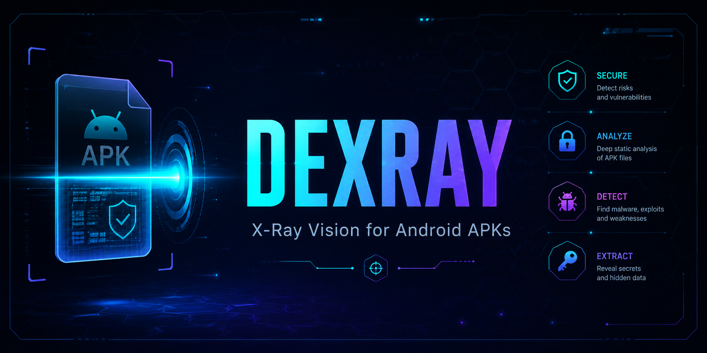

# 🔒 DexRay — APK Security Scanner

> Static security analysis for Android APKs — 100+ secret patterns, 50+ vulnerability checks, OWASP Mobile Top 10 & MASVS aligned.

[](https://python.org)
[](LICENSE)
[](https://typer.tiangolo.com)
[](https://fastapi.tiangolo.com)
[](https://owasp.org/www-project-mobile-top-10/)

<p align="center">
  
</p>

## ✅ Overview

DexRay is a static security analysis tool for Android APKs — 100+ secret patterns, 50+ vulnerability checks, multiple interfaces aligned with OWASP Mobile Top 10 and MASVS.

---

## 🚀 Quick Start

```bash
pip install -e . && pip install -e ".[dev]"
```

| Interface | Command |
|-----------|---------|
| **CLI** | `dexray scan app.apk` |
| **Web** | `uvicorn web.main:app` |
| **Docker** | `docker compose up` |

---

## 🧪 CLI Usage

```bash
dexray scan app.apk               # Full analysis + reports
dexray quick app.apk              # Quick overview
dexray manifest app.apk           # Manifest details
dexray strings app.apk --search "api" --count 100
dexray permissions app.apk --dangerous
dexray info app.apk
```

## ✅ Features

- 🔐 **100+ Secret Patterns** – Cloud tokens, auth secrets, API keys
- 🛡️ **50+ Vulnerability Checks** – OWASP Mobile Top 10 aligned
- 🌐 **Multi-Interface** – CLI, Web dashboard, Docker
- 📸 **Dark Theme UI** – Modern responsive design
- 📄 **Three Report Formats** – JSON, HTML, PDF
- 🔌 **Plugin System** – Extend with custom scanners
- 📊 **Real-time Analysis** – Live progress tracking
- 🌐 **Detailed Results** – Severity charts, evidence, recommendations

## 📁 Project Structure

```
dexray/
├── assets/                     # App icon, splash screen, screenshots
├── BRANDING.md                 # Brand asset generation guide
├── cli/main.py                 # Typer CLI
├── web/main.py                 # FastAPI
├── config/settings.py          # Configuration
├── core/
│   ├── models.py               # Data models
│   └── analysis_engine.py      # Async orchestrator
├── scanner/modules/            # 17 scanner modules
│   ├── manifest_scanner.py     # AndroidManifest.xml
│   ├── certificate_scanner.py  # TLS/SSL cert extractor
│   ├── strings_scanner.py      # DEX/XML/SO strings
│   ├── security_checker.py     # 50+ checks
│   ├── secret_scanner.py       # 100+ patterns
│   ├── network_config_scanner.py
│   ├── asset_scanner.py        # Assets listing
│   ├── native_scanner.py       # .so libraries
│   ├── url_scanner.py          # URL extraction
│   ├── env_scanner.py          # .env files
│   ├── build_config_scanner.py # Gradle config
│   ├── debug_tools_scanner.py  # Stetho, Flipper
│   ├── tracking_scanner.py     # Analytics SDKs
│   ├── firebase_scanner.py     # Firebase config
│   ├── deep_link_scanner.py    # URL schemes
│   ├── permission_audit_scanner.py
│   └── apk_signer_scanner.py   # Signing detection
├── reports/                    # Report generators
├── tests/                      # 43+ tests
└── scanner/plugins/            # Plugin framework
```

## 🌐 API Endpoints

| Method | Path | Description |
|--------|------|-------------|
| POST | `/upload` | Upload APK |
| POST | `/analyze/{scan_id}` | Trigger analysis |
| GET | `/status/{scan_id}` | Check scan status |
| GET | `/scan/{scan_id}` | HTML results page |
| GET | `/report/{scan_id}` | View HTML report |
| GET | `/download/{scan_id}/{format}` | Download JSON/HTML/PDF |
| GET | `/api/scan/{scan_id}` | Full scan results |
| GET | `/api/scan/{scan_id}/vulnerabilities` | Filtered vulns |
| GET | `/api/scan/{scan_id}/secrets` | Discovered secrets |

## ⚙️ Configuration

```env
APK_UPLOAD_DIR=/tmp/apk-analyzer/uploads
APK_OUTPUT_DIR=/tmp/apk-analyzer/reports
APK_TEMP_DIR=/tmp/apk-analyzer/temp
APK_SERVER_HOST=0.0.0.0
APK_SERVER_PORT=8000
APK_SERVER_WORKERS=4
```

## 🛡️ Standards

- **OWASP:** Mobile Top 10, MASVS (STORAGE, CRYPTO, NETWORK, PLATFORM, RESILIENCE, PRIVACY, AUTH)
- **CWE:** 89, 200, 250, 259, 295, 312, 319, 321, 327, 347, 470, 489, 494, 532, 656, 798, 923, 925, 926, 927, 1021, 1104

## 🤝 Contributing

Contributions are welcome! Please see [CONTRIBUTING.md](CONTRIBUTING.md) for guidelines.

## 📄 License

MIT

## 🔒 Security

For reporting security vulnerabilities, please see [SECURITY.md](SECURITY.md).
